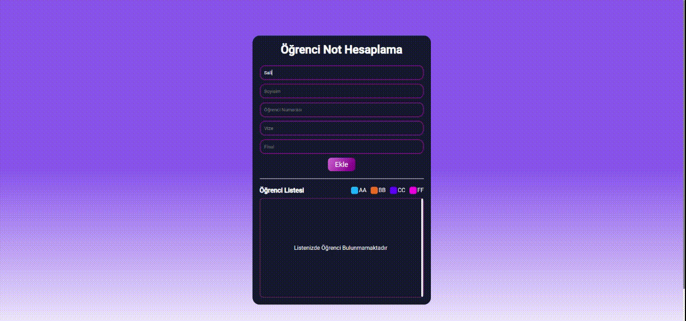

# Grade-Calculation
The purpose of the program is to calculate the average by entering student names and grade information and at the same time edit the entered grades and add them back to the list.

I created this page using html css and mainly js.

This work helped me to understand the functional features of the js programming language and the concept of DOM.

